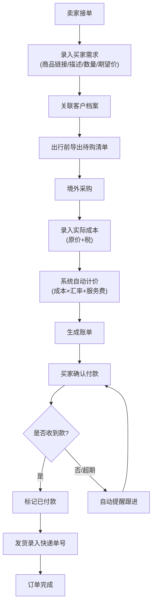
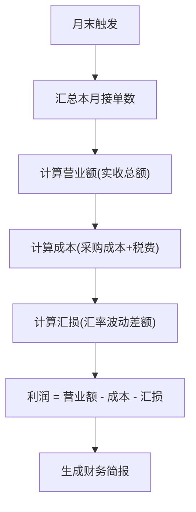

## 1. 产品概述

海外代购订单管理工具，面向个人代购卖家，提供从接单、采购、结算到售后的全流程管理。解决代购卖家用微信/Excel手工记账的混乱问题，实现订单追踪、自动计价、收款提醒和月度财务汇总。

- 目标用户：做海外代购生意的个人卖家（如日本/韩国/欧美代购）
- 核心价值：一个工具管完全部代购流程，告别漏单、错算、忘记催款

## 2. 核心功能

### 2.1 用户角色

| 角色 | 使用方式 | 核心权限 |
|------|----------|----------|
| 代购卖家 | 直接使用 | 管理全部订单、客户、财务数据 |
| 买家 | 通过分享链接 | 查看自己的订单状态和物流信息 |

### 2.2 功能模块

1. **工作台**：待办提醒、快捷操作、数据概览
2. **订单管理**：新建/编辑/查看订单，状态流转全生命周期
3. **客户管理**：客户档案、购买喜好、主动询价提醒
4. **财务管理**：账单生成、收款追踪、月度财务简报
5. **出行计划**：出行前导出待购清单、主动询问老客户

### 2.3 页面详情

| 页面名称 | 模块名称 | 功能描述 |
|----------|----------|----------|
| 工作台 | 数据概览 | 显示今日待办、待购订单数、待收款金额、本月营业额 |
| 工作台 | 待办提醒 | 显示超期未付款订单、即将出行需确认的订单、老客户跟进提醒 |
| 工作台 | 快捷操作 | 新建订单、导出待购清单、查看月度简报入口 |
| 订单管理 | 订单列表 | 按状态筛选（全部/待采购/已采购/待付款/已付款/已发货/已完成），支持搜索 |
| 订单管理 | 新建订单 | 录入买家信息、商品链接/描述、数量、期望价格，选择关联客户 |
| 订单管理 | 订单详情 | 查看完整订单信息、状态流转记录、录入成本/物流等 |
| 订单管理 | 成本录入 | 录入商品原价、税率/税额，系统自动计算应收金额 |
| 订单管理 | 账单生成 | 根据计算规则生成买家账单，支持复制/分享 |
| 订单管理 | 物流录入 | 录入快递单号、物流公司，买家可查看物流状态 |
| 客户管理 | 客户列表 | 显示所有客户，支持搜索和筛选 |
| 客户管理 | 客户详情 | 历史订单、购买偏好标签、累计消费、备注 |
| 客户管理 | 询价提醒 | 出行前标记需询问的客户，一键发送询问模板 |
| 财务管理 | 收款追踪 | 未确认收款和超期订单列表，一键催付提醒 |
| 财务管理 | 月度简报 | 本月接单数、营业额、成本、利润、汇损明细 |
| 出行计划 | 待购清单 | 按出行批次组织待购订单，导出清单（含商品信息+数量） |
| 出行计划 | 出行管理 | 创建出行计划，关联待购订单，标记出行状态 |
| 买家查看页 | 订单状态 | 买家通过链接查看订单状态、账单金额、物流信息 |

## 3. 核心流程

### 3.1 代购订单全流程

卖家接单 → 录入买家需求 → 出行前导出待购清单 → 境外采购 → 录入实际成本 → 系统自动计价 → 生成账单发给买家 → 买家确认付款 → 标记已付款 → 发货录入快递单号 → 订单完成

### 3.2 月末财务汇总流程

## 4. 用户界面设计

### 4.1 设计风格

- **主色调**：深靛蓝 (#1e3a5f) + 琥珀金 (#d4a853)，传达专业可靠与海外高端感
- **辅助色**：暖灰背景 (#f5f3ef)、翠绿状态 (#2d9d78)、珊瑚红提醒 (#e85d4a)
- **按钮风格**：圆角 8px，主按钮靛蓝底白字，次按钮白底靛蓝边框
- **字体**：标题使用 Playfair Display，正文使用 Noto Sans SC
- **布局风格**：左侧导航栏 + 右侧内容区，卡片式模块布局
- **图标风格**：线性图标 (Lucide Icons)，2px 描边

### 4.2 页面设计概览

| 页面名称 | 模块名称 | UI元素 |
|----------|----------|--------|
| 工作台 | 数据概览 | 四宫格卡片，数字突出显示，带趋势箭头动画 |
| 工作台 | 待办提醒 | 时间轴样式，红色标记紧急事项，滑入动画 |
| 工作台 | 快捷操作 | 大号图标按钮，悬浮上移效果 |
| 订单管理 | 订单列表 | 表格布局，状态标签彩色圆角，行悬浮高亮 |
| 订单管理 | 新建/编辑 | 侧滑抽屉表单，分步填写引导 |
| 订单管理 | 订单详情 | 右侧面板，顶部状态进度条，分区块信息展示 |
| 订单管理 | 账单预览 | 模态弹窗，账单模板样式，一键复制按钮 |
| 客户管理 | 客户列表 | 卡片网格，头像+标签，悬浮展开详情 |
| 客户管理 | 客户详情 | 标签页切换（档案/订单/偏好） |
| 财务管理 | 月度简报 | 数据仪表盘风格，饼图+柱状图，打印友好 |
| 出行计划 | 待购清单 | 清单卡片，支持勾选已购，导出按钮醒目 |
| 买家查看页 | 订单追踪 | 简洁单页，状态步骤条+物流时间轴 |

### 4.3 响应式设计

- 桌面优先（1440px基准），适配1280px/1024px
- 平板适配：左侧导航收起为图标模式，内容区全宽
- 移动端：底部Tab导航，卡片单列堆叠，表单全屏

### 4.4 计价规则配置

| 配置项 | 说明 | 默认值 |
|--------|------|--------|
| 默认汇率 | 外币转人民币汇率 | 按实时或手动设置 |
| 服务费比例 | 按成本加收的服务费百分比 | 10% |
| 汇率来源 | 手动输入 / 固定值 | 手动输入 |
| 税费计算 | 单独录入 / 按比例自动算 | 单独录入 |
| 计算公式 | 成本(原价+税) × 汇率 × (1+服务费比例) | 默认公式 |
