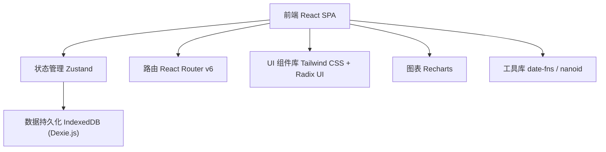
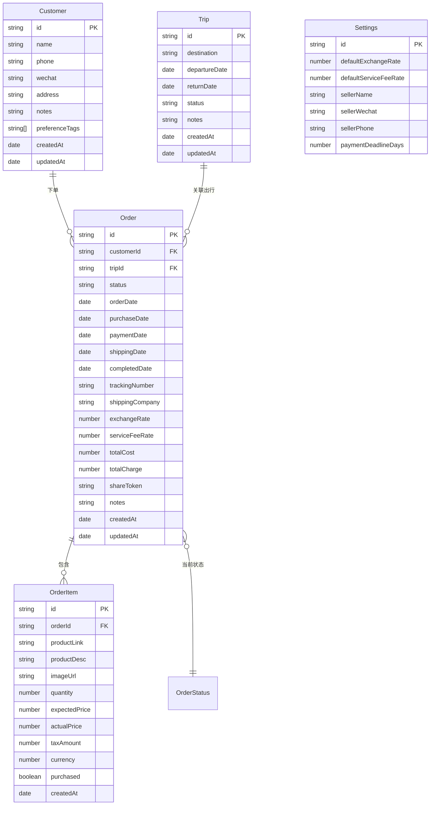

## 1. 架构设计



纯前端架构，无需后端服务。所有数据存储在浏览器 IndexedDB 中，支持大量订单数据的高效读写。

## 2. 技术说明

- **前端框架**：React@18 + TypeScript
- **样式方案**：Tailwind CSS@3 + Radix UI（无样式可定制组件）
- **构建工具**：Vite
- **状态管理**：Zustand（轻量级，适合中小型应用）
- **数据持久化**：Dexie.js（IndexedDB 封装，支持复杂查询和事务）
- **路由**：React Router v6
- **图表**：Recharts（月度财务简报可视化）
- **日期处理**：date-fns
- **唯一ID**：nanoid
- **图标**：Lucide React
- **无后端**：所有数据本地存储，支持导出/导入 JSON 备份

## 3. 路由定义

| 路由 | 用途 |
|------|------|
| `/` | 工作台首页，数据概览和待办提醒 |
| `/orders` | 订单列表页，按状态筛选和搜索 |
| `/orders/new` | 新建订单 |
| `/orders/:id` | 订单详情（含成本录入、账单、物流） |
| `/customers` | 客户列表页 |
| `/customers/:id` | 客户详情页（档案、订单、偏好） |
| `/finance` | 财务管理页（收款追踪） |
| `/finance/report` | 月度财务简报 |
| `/trips` | 出行计划列表 |
| `/trips/:id` | 出行详情（关联待购订单、导出清单） |
| `/settings` | 系统设置（汇率、服务费比例、个人信息） |
| `/track/:token` | 买家查看页（公开链接，无需登录） |

## 4. 数据模型

### 4.1 数据模型定义



### 4.2 数据定义语言 (IndexedDB Schema via Dexie.js)

```typescript
import Dexie, { Table } from 'dexie'

interface Customer {
  id: string
  name: string
  phone: string
  wechat: string
  address: string
  notes: string
  preferenceTags: string[]
  createdAt: Date
  updatedAt: Date
}

interface Order {
  id: string
  customerId: string
  tripId?: string
  status: 'pending_purchase' | 'purchased' | 'pending_payment' | 'paid' | 'shipped' | 'completed' | 'cancelled'
  orderDate: Date
  purchaseDate?: Date
  paymentDate?: Date
  shippingDate?: Date
  completedDate?: Date
  trackingNumber?: string
  shippingCompany?: string
  exchangeRate: number
  serviceFeeRate: number
  totalCost: number
  totalCharge: number
  shareToken: string
  notes: string
  createdAt: Date
  updatedAt: Date
}

interface OrderItem {
  id: string
  orderId: string
  productLink: string
  productDesc: string
  imageUrl?: string
  quantity: number
  expectedPrice: number
  actualPrice?: number
  taxAmount?: number
  currency: string
  purchased: boolean
  createdAt: Date
}

interface Trip {
  id: string
  destination: string
  departureDate: Date
  returnDate?: Date
  status: 'planning' | 'in_progress' | 'completed'
  notes: string
  createdAt: Date
  updatedAt: Date
}

interface Settings {
  id: string
  defaultExchangeRate: number
  defaultServiceFeeRate: number
  sellerName: string
  sellerWechat: string
  sellerPhone: string
  paymentDeadlineDays: number
}

class DaigouDB extends Dexie {
  customers!: Table<Customer>
  orders!: Table<Order>
  orderItems!: Table<OrderItem>
  trips!: Table<Trip>
  settings!: Table<Settings>

  constructor() {
    super('DaigouDB')
    this.version(1).stores({
      customers: 'id, name, phone, wechat, createdAt',
      orders: 'id, customerId, tripId, status, orderDate, shareToken, createdAt',
      orderItems: 'id, orderId, createdAt',
      trips: 'id, destination, status, departureDate, createdAt',
      settings: 'id'
    })
  }
}
```

## 5. 计价逻辑

```
应收金额 = Σ(每项商品 (实际原价 + 税额)) × 汇率 × (1 + 服务费比例)
利润 = 实收总额 - 成本总额(原价+税费的人民币) - 汇损
汇损 = 实际结算汇率与记账汇率的差异 × 成本外币总额
```

## 6. 项目目录结构

```
src/
├── components/          # 通用UI组件
│   ├── ui/              # 基础组件 (Button, Input, Modal, Badge等)
│   └── layout/          # 布局组件 (Sidebar, Header, PageContainer)
├── pages/               # 页面组件
│   ├── Dashboard/       # 工作台
│   ├── Orders/          # 订单管理
│   ├── Customers/       # 客户管理
│   ├── Finance/         # 财务管理
│   ├── Trips/           # 出行计划
│   ├── Settings/        # 系统设置
│   └── Track/           # 买家查看页
├── stores/              # Zustand状态管理
├── db/                  # Dexie数据库定义和操作
├── utils/               # 工具函数 (计价、日期、格式化)
├── hooks/               # 自定义Hooks
├── types/               # TypeScript类型定义
└── App.tsx              # 应用入口
```
